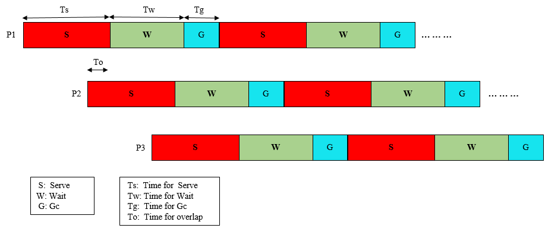
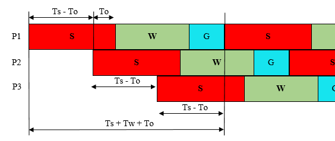

# Multi-process GC mechanism of BFE

# 1. Background

At the beginning of 2014, the work of recfactoring BFE forwarding engine based on Go language was started. At that time, the Go version was 1.3, and the problem of GC (Garbage Collection) delay was very serious. According to the measured data of BFE, the GC delay reached 400ms in the case of 1 million concurrent connections, completely unable to meet the delay requirements of the forwarding service. For this reason, the "multi-process rotation" mechanism was introduced in BFE at that time to reduce the impact of GC delay on forwarding traffic. The problem of GC delay was better solved in Go1.8 released at the beginning of 2017. Most GC delays were reduced to less than 1ms, which can meet the business requirements. Therefore, the multi-process rotation mechanism was removed from BFE in 2017.

Although this scheme has been abandoned at present, some of its designs are universal and may be used for reference in similar scenarios in the future.

# 2. Model

## 2.1 Multi-Process Rotation

Let's review a classic high-performance server design pattern: Prefork. In this mode, after the program starts, it creates a socket first, and then forks out multiple child processes. According to the process model of Linux, the child process after forking directly inherits the socket object created by the parent process. As shown in the following pseudocode, the parent process performs the listen operation and the child process performs the accept operation. The parent process generally does some management functions, such as restarting the child process; The child process does the processing of external requests, and the capabilities of multiple child processes are equivalent.

Beginning with kernel version 3.9, Linux supports a mechanism called reuseport, which can achieve the same effect.

```c
fd = socket()				// create socket
bind(fd, IP_ADDRESS)		// bind address
...
listen(fd, back)			// start to listen
...
pid = fork()				// fork child process
if (pid == 0) {
    // for child process
    newFd = accept(fd)
    process(newFd)			// connection processing logic
    ...
} else {
    // for parent process
    ...
}
```


For the GC latency problem of BFE written in Go language, we tried to use the above multi-process mechanism to reduce the impact of GC latency at the beginning. When multiple child processes are used to serve at the same time, the number of requests undertaken by each child process will be reduced, which can alleviate the delay caused by GC.

Although the above mechanism can reduce the absolute value of GC delay, the actual GC delay is still tens or even hundreds of milliseconds, which is still unacceptable for forwarding services.

In order to solve the above problems, the "multi-process rotation" mechanism is added on the basis of the multi-process model. The basic idea of "multi-process rotation" is to control multiple child processes in the Prefork mode and make them in the "Serve" state or "GC" state in turn. When the process is in the "Serve" state, it can accept the new connection and process the request. In order to avoid the impact of GC delay, it will close GC; When the process is in the "GC" state, stop accepting new connections and start GC to free unused memory.

The essence of the "multi-process rotation" mechanism is to reduce latency by increasing memory consumption. Due to the delay of the child process GC processing, the child process will consume more memory. The specific consumption depends on the duration of the GC stop and the throughput of the service traffic during this period. When using the "multi-process rotation" mechanism, the memory usage needs to be fully estimated.

An important assumption of the "multi-process rotation" mechanism is that at that time, the traffic served by BFE was mainly HTTP requests, mostly short connections, and most of the requests sent within a TCP connection were 2-3 requests. For most connections, by selecting the appropriate state switch time parameter, most requests will be processed in the "Serve" state, and only a few requests will fall in the "GC" state. A "Wait" state is also added between the "Serve" state and the "GC" state. In this state, new connections are not accepted, and GC will also be closed to reduce the impact of GC latency on HTTP requests in established connections.

## 2.2 Definition of Child Process States

In the "multi-process rotation" mode, each sub-process of BFE has four states (as shown in the figure below):

- Init

  - It is the initialization state of child process 

  - After initialization,  the Serve state

- Serve

  - The child process accepts the new connection (performs the accept operation) and processes the request

  - Child process actively disables GC

- Wait

  - The child process no longer accepts new connections (does not perform the accept operation), and only processes the newly arrived requests in the existing long connections

  - In this state, GC is still disabled

- Gc

  - The child process will not accept new connections, but will still process the newly arrived requests in the existing long connections

  - In this state, the system will execute GC


Between the three states of Serve, Wait and GC, timeout is used as the trigger mechanism for state switching.

When the child process is in the Serve and Wait states, the requests in the connection served by the child process will not be affected by the GC delay; When the child process is in the GC state, if there are requests in the connection being served at this time, the requests may be affected by the GC delay (depending on the coincidence relationship between the request arrival time and the memory  garbage collection execution time).

# 3. Determination of Relevant Parameters

There are still details to be solved when applying the "multi-process rotation" mechanism to the actual program, including:

+ Selection of switching time parameters between three states

+ Determination of the number of child processes

+ Memory size required

These issues are discussed below.

## 3.1 Selection of Switching Time Parameters



The above figure shows the timing relationship of state switching in the scenario of multiple child processes coexisting. It shows three time parameters for child process state switching:

- Ts: Duration of Serve state

- Tw: Duration of Wait state

- Tg: duration of GC state

For multiple child processes, at least one child process must be in the Server state at any time. Considering the time error of controlling process state switching, it is required that there is a certain overlap between the two adjacent child processes in the Serve state to ensure that there is no vacancy in the Serve state. A parameter, **To**, is introduced to indicate the time when two child processes overlap in the Serve state.

Let's discuss how to select these time parameters.

- Selection of Ts:

  The larger the value of Ts, the more memory the child process consumes before GC; The smaller the value of Ts, the more child processes are required. In practice, Ts is generally set to 5 seconds.

- Selection of Tw:

  The value of Tw should be as large as possible to ensure that HTTP requests can be processed for most connections within this time interval; At the same time, it should be considered that the larger the value of Tw, the more memory the child process consumes before GC. In practice, Tw is generally set to 30 seconds.

- Selection of Tg :

  GC processing takes some time. Tg should be large enough to ensure that GC processing can be completed before the next Serve state arrives; However, if Tg is too large, the number of processes required by the system will increase. In practice, Tg is generally set to 2-3 seconds.

- Selection of To:

  To can only ensure that there is no "service vacancy" between multiple child processes. In practice, To is generally set to 1 second.

## 3.2 Calculation of the Number of Child Processes

According to the given time parameters, the required number of child processes can be calculated.




Define the number of child processes required as N, and the calculation formula of N is:


- Where, for (Tw+Tg+To)/(Ts-To), round up

- Explanation:

  - Consider the service cycle of a BFE process (as shown in the above Figure, including the three states of Serve, Wait and GC)

  - Other child processes are required to provide services within the time of To+Tw+Tg

  - Due to the existence of To, the time that each child process can cover is (Ts - To)

- Example:

  - Ts=5 seconds, Tw=20 seconds, Tg=3 seconds, To=1 second

  - N = 1 + (20 + 3 + 1) / (5 - 1) = 7

## 3.3 Calculation of Memory Consumption

Under the "multi-process rotation" mechanism, due to the active shutdown of GC in the Serve and Wait states, a large amount of memory needs to be consumed. Here we estimate the memory consumption of BFE under the "multi-process rotation" mechanism.

- Define the maximum memory consumption as M

  - M=(Ts+Tw+Tg) * Memory consumption speed

  - The memory consumption speed can only be obtained by offline pressure test or online measured data

- Example:

  - Ts=5 seconds, Tw=20 seconds, Tg=3 seconds

  - Assume that the memory consumption rate is 20GB per minute from observation

  - M = (5 + 20 + 3) \* 20 / 60 = 9.4GB

## links
Previous: [Chap 34 How to Develop BFE Extension Module](../../../en_us/develop/how_to_write_module/how_to_write_module.md)  