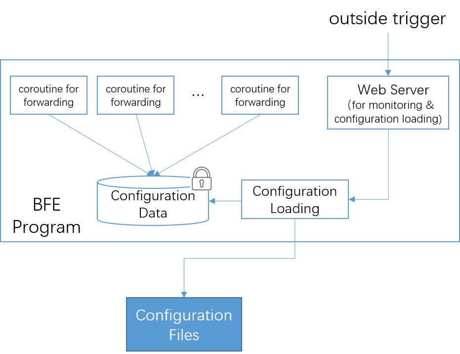

# Configuration Management

## Distribution of BFE Configurations

The configuration files are all located in [/conf](https://github.com/bfenetworks/bfe/tree/master/conf) directory. For the convenience of maintenance, configuration files are stored in corresponding directories by function category.

+ The main configuration files of BFE main logic are as follows:

| Function category             | Directory of file location | Name of configuration file | Description                                                  |
| ----------------------------- | -------------------------- | -------------------------- | ------------------------------------------------------------ |
| Main configuration            | /conf/                     | bfe.conf                   | Including basic configuration of BFE, such as service port, default timeout configuration,  loading of extension modules, etc; It also includes the basic configuration of TLS, such as the encryption suite of HTTPS and the configuration of Session Cache. |
| Configuration about protocol  | /conf/tls_conf/            | server_cert_conf.data      | Server-side certificate and key configuration.               |
| Configuration about protocol  | /conf/tls_conf/            | session_ticket_key.data    | TLS Session Ticket Key configuration.                        |
| Configuration about protocol  | /conf/tls_conf/            | tls_rule_conf.data         | TLS protocol parameters organized by tenant.                 |
| Configuration about routing   | /conf/server_data_conf/    | vip_rule.data              | VIP list of each tenant                                      |
| Configuration about routing   | /conf/server_data_conf/    | host_rule.data             | Domain names of each tenant                                  |
| Configuration about routing   | /conf/server_data_conf/    | route_rule.data            | Forwarding rules of each tenant.                             |
| Configuration about routing   | /conf/server_data_conf/    | cluster_conf.data          | The forwarding configuration of each cluster, including cluster basic configuration, GSLB basic configuration, health check configuration, back-end basic configuration, etc. |
| Configuration about routing   | /conf/server_data_conf/    | name_conf.data             | Mapping between service name and service instances.          |
| Configuration about balancing | /conf/cluster_conf/        | cluster_table.data         | The sub-clusters in each backend cluster and the instances in each sub-cluster. |
| Configuration about balancing | /conf/cluster_conf/        | gslb.data                  | The weights for balancing between multiple sub-clusters in each cluster. |

+ Configuration files for BFE extension module

  For the convenience of management, the configuration files for BFE extension modules and BFE main logic are stored separately. For each extension module, there is an independent directory for configuration files, which is located in the "/conf/mod_<name>/" directory. For example: The configuration files of mod_block are located in /conf/mod_block/ directory.


## Normal Configuration vs Dynamic Configuration

In BFE, configuration is divided into "normal configuration" and "dynamic configuration":

+ Normal configuration

  It takes effect only when the program is started. In BFE, the normal configuration is generally based on the INI format, and the normal configuration file name generally uses the suffix ". conf".

+ Dynamic configuration

  It can be loaded dynamically during program execution. In BFE, dynamic configuration is generally based on JSON format, taking into account the needs of program processing and manual reading.

Dynamic configuration file names generally use the suffix ". data".

## Implementation of Dynamic Configuration

The implementation mechanism of dynamic configuration in BFE is shown in the figure below, mainly including "configuration loading" and "configuration taking effect".



### Configuration Loading

As described in "[Status Monitoring](../monitor/monitor. md)", a Web server is embedded in the BFE program for reading the status information inside the BFE externally. This web server is also used to trigger the dynamic loading of the configuration.

For example, by accessing http://127.0.0.1:8421/reload/gslb_data_conf You can trigger the reload of gslb.data.

For security reasons, access to this interface can only be allowed when it is initiated from the same server where the BFE program is deployed. This restriction is located in the [implementation of Web Monitor](https://github.com/baidu/go-lib/blob/master/web-monitor/web_monitor/web_monitor.go ):

```
// source ip address allowed to do reload
var RELOAD_SRC_ALLOWED = map[string]bool{
	"127.0.0.1": true,
	"::1":       true,
}
```

If an access is initiated from an address outside this range, an error like the following will be returned

```
{
    "error": "reload is not allowed from [xxx.xxx.xxx.xxx:xxx]"
}
```

Through the callback function registered in the embedded Web Server, the configuration loading logic will execute the following logic:

+ Reading of configuration file

+ Decoding and correctness check of configuration file

+ Update of running configuration information

### Configuration Taking Effect

In BFE, parallel processing is based on the "Go routine" provided by the Go language. BFE uses the mechanism of "multi-coroutine communication within a single process". It does not need to consider multi-process communication, but only needs to consider the shared data between the coroutines. In terms of shared data between multiple coroutine, it is similar to the multi-threading mechanism. The shared data can be accessed within the same process and use "lock" for mutual exclusive access. Because of the difference between the implementation mechanism of the coroutine and the thread, the cost of the "coroutine lock" is far less than that of the "thread lock".

In BFE, the configuration information loaded from the file will be saved in a critical section protected by the coroutine lock. When using configuration data, the coroutine responsible for forwarding needs to read from the critical section through a specific interface; The configuration loading logic also operates through a specific interface when updating the configuration information.

In mod_block, for example, [ProductRuleTable](https://github.com/bfenetworks/bfe/blob/master/bfe_modules/mod_block/product_rule_table.go) is used to save the configuration information of each tenant. To read the configuration information, the following interface is provided:

```
func (t *ProductRuleTable) Search(product string) (*blockRuleList, bool) {
	t.lock.RLock()
	productRules := t.productRules
	t.lock.RUnlock()

	rules, ok := productRules[product]
	return rules, ok
}
```

To update the configuration information, the following interface is provided:

```
func (t *ProductRuleTable) Update(conf productRuleConf) {
	t.lock.Lock()
	t.version = conf.Version
	t.productRules = conf.Config
	t.lock.Unlock()
}
```

The above two interfaces are protected by read-write locks. Moreover, the operation in the critical section should be as simple as possible to reduce the impact on the parallelism of multiple processing coroutines.
