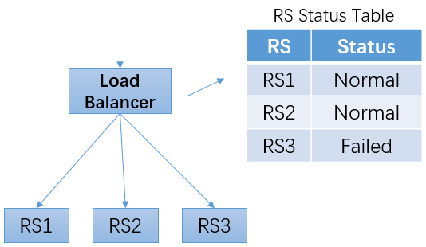
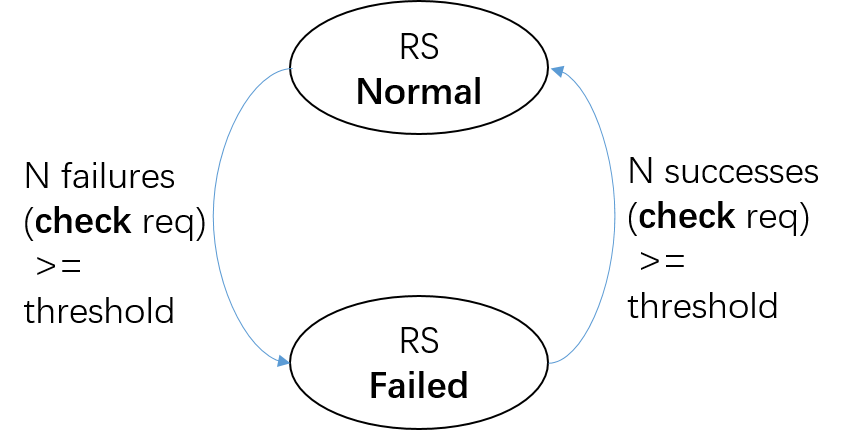
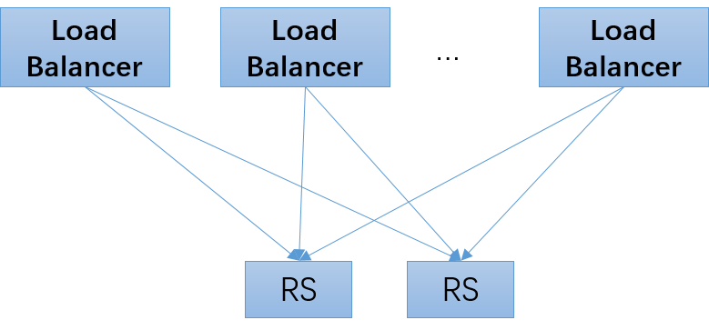
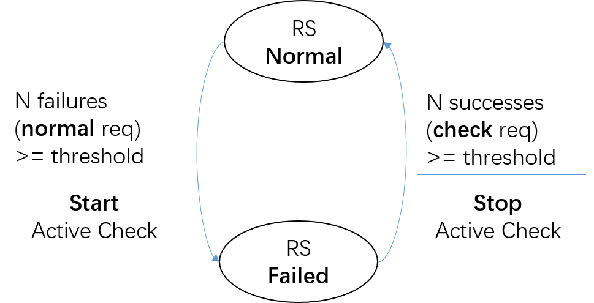
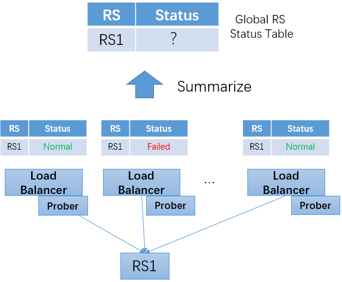
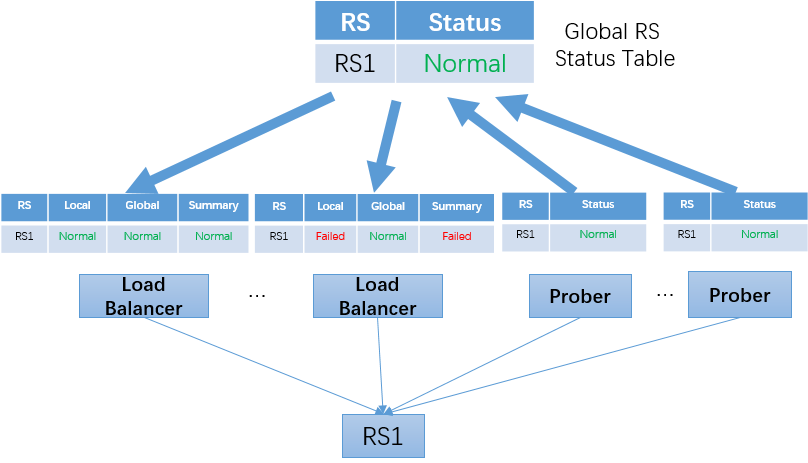
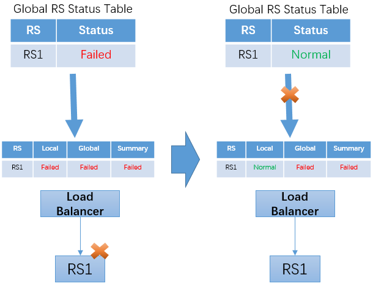

# Health Check

## Basics of Health Check

In the load balancing system, a RS status table is maintained to save the health status of each RS. When forwarding traffic, traffic will only be forwarded to RS with health status of "normal".

In order to obtain the health status of RS, the load balancing system will periodically send health check requests to RS and modify the health status of corresponding RS according to the response received.

## Active Health Check vs Passive Health Check

### Active Health Check

The mechanism of "**Active Health Check**" can be briefly described as follows:

+ The load balancing system **continuously** sends health check requests to RS for detection

+ When RS is "normal", if the number of consecutive detection failures reaches a certain threshold, the health status of RS will be changed to "failed"

+ When RS is "failed", if the number of consecutive successful detection reaches a certain threshold, the health status of RS will be changed to "normal"

The state change of RS in active health check can be described by a simple finite state machine.

For health check, an important indicator is "response time", that is, when the RS status changes, how long it takes for the load balancing system to perceive the change. If the failure of RS is not detected in time, the request may be sent to the failed RS node, resulting in service failure; If the recovery of RS cannot be sensed in time, it may cause excessive pressure on other normal RS nodes.

For active health check, the way to reduce response time is to increase the frequency of sending health check requests. But this solution also has a price. On the one hand, it will increase the pressure of the load balancing system to send health check requests; On the other hand, it will also increase the pressure of RS. The second problem becomes more prominent in the software load balancing scenario.

### Passive Health Check

As mentioned in the previous chapter "[Trend of Network Front End Technology](../../front_principle/trend/trend. md)", "Software based" is an important trend of network front end system. An important feature of software load balancing system is to support large-scale scale-out deployment of load balancing nodes. In the traditional hardware load balancing scenario, the most common deployment mode is "active+standby". The upstream of RS is usually two load balancing nodes. In the software load balancing scenario, a load balancing cluster may consist of dozens of nodes. Especially for the layer-7 load balancing scenario, the capacity of a single load balancing node is small, and a single cluster can reach hundreds of nodes. In this case, if you continue to use the "active health check" mechanism, the continuous health check request will exert great pressure on the downstream RS.

To solve the above problems, "**Passive Health Check**" can be used, which is briefly described as follows:

+ When RS is "normal", the load balancing system will not actively send health check requests to RS

+ When RS is "normal", if the number of consecutive failures of RS **processing normal requests** exceeds a certain threshold, the health status of RS will be changed to "failed"

+ When RS is "failed", the load balancing system starts to send health check requests to RS

+ When RS is "failed", if the number of consecutive successful health check detection reaches a certain threshold, the health status of RS will be changed to "normal"

The state change of RS and the start and stop of detection in the passive health check can be described by the following finite state machine.

### Combination of Active and Passive Health Check

Compared with the active health check, a significant difference of the passive health check is that it uses normal service requests to "piggyback" detection. The benefits of this solution are:

+ Under normal conditions of RS, there is no need to send additional health check requests, thus reducing the processing cost of load balancing system and RS

+ In the case that RS processes normal requests in high frequency (that is, the frequency of normal requests is much higher than that of health check  requests), passive health check can detect RS exceptions faster

Passive health check also has its disadvantages:

+ If the service request cannot be retried, the normal request may fail in the case of RS failure

+ When the frequency of normal requests is low (for example, for a certain RS, there is only one request in a few minutes), it may lead to failure of discovering RS failure in time

Combining the advantages and disadvantages of active and passive health check, it is suggested to adopt the combination of active and passive modes in practice:

+ Enable passive health check, which can help RS with high frequency of requests quickly find the failure without bearing the cost of high-frequency health check requests

+ At the same time, the "low frequency" (such as once every 30 seconds or 60 seconds) active health check is started to detect the failure of RS with low request frequency in time

When using the active and passive combination mechanism, the health status of RS is summarized by the two health check results. If the check result of one of the two is failed, the status of RS is failed; RS status is normal only when the results of both checks are normal.

## Centralized Health Check vs Distributed Health Check

When using the active health check mechanism, it can be classified into "distributed health check" and "centralized health check" according to the location of the prober deployment.

In the **distributed health check** mode, the prober and load balancer are deployed on the same machine. Each load balancer instance maintains an independent RS status table based on its own health check results. For the same RS, each load balancer instance may get different results on health status due to differences in server status, network status (such as TOR, routing, and IDC connectivity), etc. This is exactly the advantage of distributed health check: it can most accurately reflect the RS status "seen" by each load balancer instance.

One problem of distributed health check is how to get the global RS status table. Operation personnel usually need to centrally view the status of RS on the management console. In the distributed health check mode, it is obviously unreasonable to obtain RS status information from only one load balancer instance, and it is likely to be overgeneralized; However, if the status information is read from all load balancer instances to summarize, it is a very uneconomical solution when the number of forwarding instances is relatively large; If only part of the information of the load balancer instance is selected, the selection strategy is not very simple, and multiple factors need to be considered.

Another problem with the distributed health check method is that even if the frequency of sending health check requests is relatively low, when the number of load balancer instances is relatively large (for example, hundreds) and the number of downstream RSs is relatively small (for example, only a few), it will still exert great pressure on RSs.

To solve the above problems,  "**Centralized Health Check**" can be used. The key points are described as follows:

+ Independent deployment of prober program

  Compared with a large number of load balancer instances, the number of prober instances is relatively small. For example, deploy several prober instances in each data center.

  In terms of the deployment of prober, certain considerations can be taken into consideration, for example, distributing probers under different network aggregation nodes and different TORs in the data center.

+ The global RS status table is obtained by summarizing the status of probers

+ The results of active health check will be distributed to all load balancer instances

+ The load balancer instance synthesizes the local passive health check results and the active health check results obtained from the global status table to get the RS status

When the load balancer instance uses the active health check results obtained from the global status table, it should adopt a certain fault-tolerant mechanism to prevent from not obtaining the update of the active health check results in time. The following two situations can be considered:

+ The RS status of the last active health check is "normal", and the update from the global status table is interrupted

  In this case, if the RS subsequently changes to "failed", the status change of load balancer instance can be found according to the local passive health check, and will not cause serious problems.

  

+ The RS status of the last active health check is "failed", and the update from the global status table is interrupted

  In this case, if the RS  subsequently changes to "normal", the load balancer instance will continue to use the status "failed" obtained before, so as to continue to judge RS as failed. This will result in the failure to restore RS to normal status.

  This problem can be solved by adding a timeout mechanism to the load balancer. The status information obtained from the global status table is invalid after a certain time. If there is no new update information, it will degenerate into relying only on the local passive health check results.

  

## Health Check of BFE

BFE open source project currently only supports passive health checks. The commercial product implemented based on the BFE open source project includes centralized active health check.

## links
Previous: [Chap10 Plugin Architecture](../../../en_us/design/module/module.md)  
Next: [Chap12 Traffic Limiting](../../../en_us/design/limit/limit.md)