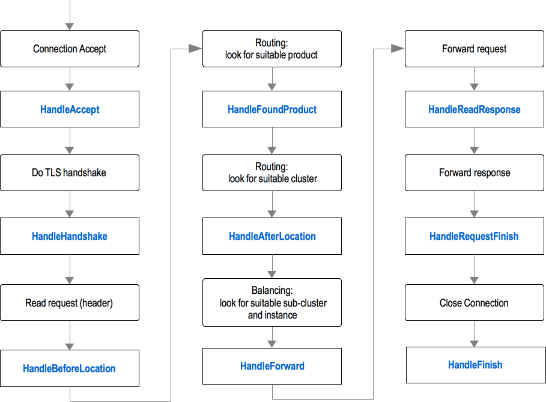

# Plugin Architecture

## Introduction

BFE supports plugin architecture that makes it possible to develop new features rapidly by writing plugins (i.e. modules).

With the BFE plugin architecture:

- Multiple callback points are provided in the forwarding process in BFE. For a module, you can write callback functions corresponding to these callback points.
- When initializing a module, callback functions are registered on specified callback points.
- On processing each request/connection, when reaching a certain callback point, all registered callback functions are executed sequentially.

The following will briefly introduce the callback points in BFE, and list the built-in modules in BFE. For the detailed design of the callback framework, please refer to the description in the chapter "[Callback Framework](../../implementation/module_frame/module_frame.md)". In the chapter "[How to develop BFE module](../../development/how_to_write_module/how_to_write_module.md)", the method of developing BFE module is described in detail with an example.

## Callback Points in Forwarding Process

There are 9 callback points in BFE:

- HandleAccept: after TCP connection with client is established.
- HandleHandshake: after SSL/TLS handshake with client is finished.
- HandleBeforeLocation: before the destination product for the request is identified.
- HandleFoundProduct: after the destination product is identified.
- HandleAfterLocation: after the destination cluster is identified.
- HandleForward: after the destination subcluster is identified, and before the request is forwarded.
- HandleReadResponse: after response from backend is received by BFE.
- HandleRequestFinish: after response from backend is forwarded by BFE.
- HandleFinish: after connection with client is closed.

The definition of callback points is in [/bfe_module/bfe_callback.go](https://github.com/bfenetworks/bfe/tree/master/bfe_module/bfe_callback.go)

The Callback Points in the forwarding process are shown below.

## Built-in Modules of BFE

In the directory **/bfe_modules/<module_name>** of BFE source code, there are a large number of built-in modules. The brief description of these modules is as follows:

| Category               | Module Name        | Description                                                  |
| ---------------------- | ------------------ | ------------------------------------------------------------ |
| Traffic Processing     | mod_rewrite        | mod_rewrite modifies the URI of HTTP request based on defined rules. |
|                        | mod_header         | mod_header modifies header of HTTP request/response based on defined rules. |
|                        | mod_redirect       | mod_redirect redirects HTTP requests based on defined rules. |
|                        | mod_geo            | mod_geo creates variables with values depending on the client IP address, using the GEO databases. |
|                        | mod_tag            | mod_tag sets tags for requests based on defined rules.       |
|                        | mod_logid          | mod_logid generates log ids for sessions/requests.           |
|                        | mod_trust_clientip | mod_trust_clientip checks the client IP of incoming request/connnection against trusted ip dictionary. If matched, the request/connection is marked as trusted. |
|                        | mod_doh            | mod_doh supports DNS over HTTPS.                             |
|                        | mod_compress       | mod_compress compresses responses based on specified rules.  |
|                        | mod_errors         | mod_errors replaces error responses based on specified rules. |
|                        | mod_static         | mod_static serves static files.                              |
|                        | mod_userid         | mod_userid generates user id for client identification.      |
|                        | mod_markdown       | mod_markdown convert the markdown format content in the response to html format based on specified rules. |
| Security & Anti-attack | mod_auth_basic     | mod_auth_basic implements the HTTP basic authentication.     |
|                        | mod_auth_jwt       | mod_auth_jwt implements JWT([JSON Web Token](https://tools.ietf.org/html/rfc7519)). |
|                        | mod_auth_request   | mod_auth_request supports authorizing clients based on third party authorization service. |
|                        | mod_block          | mod_block blocks incoming connections/requests based on defined rules. |
|                        | mod_prison         | mod_prison limits the amount of requests a user can make in a given period of time based on defined rules. |
|                        | mod_cors           | mod_cors enables cross-origin resource sharing.              |
|                        | mod_secure_link    | mod_secure_link is used to check authenticity and limit lifetime of links. |
| Traffic Insight        | mod_access         | mod_access writes request logs and session logs in the specified format. |
|                        | mod_key_log        | mod_key_log writes tls key logs in NSS key log format so that external programs(eg. wireshark) can decrypt TLS connections for trouble shooting. |
|                        | mod_trace          | mod_trace enables tracing for requests based on defined rules. |
|                        | mod_http_code      | mod_http_code reports statistics of HTTP response codes.     |

You can access the address for monitor http://localhost:8421/monitor/module_handlers to view all callback points in the running BFE instance, the list of module callback functions registered at each callback point and the order.
