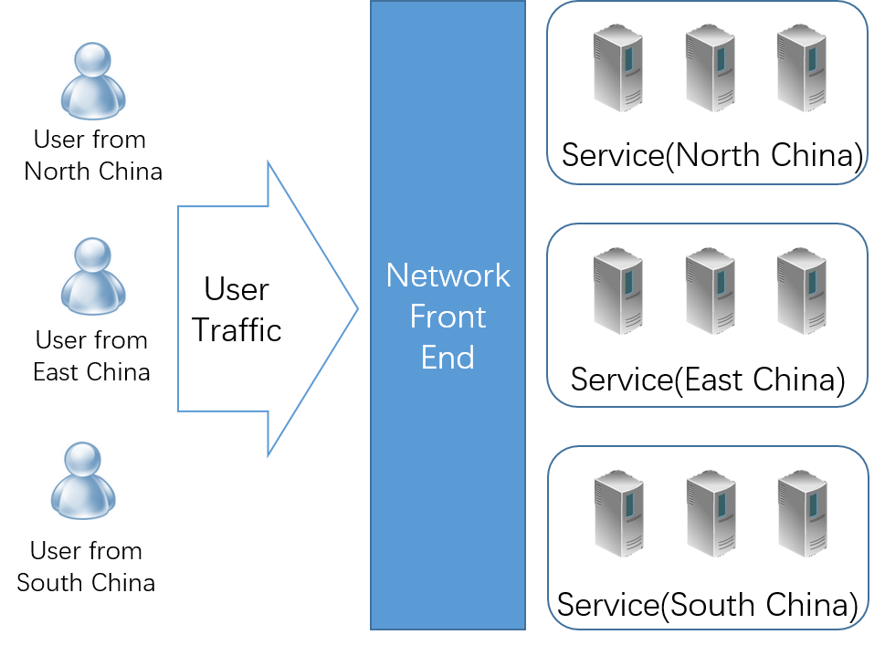
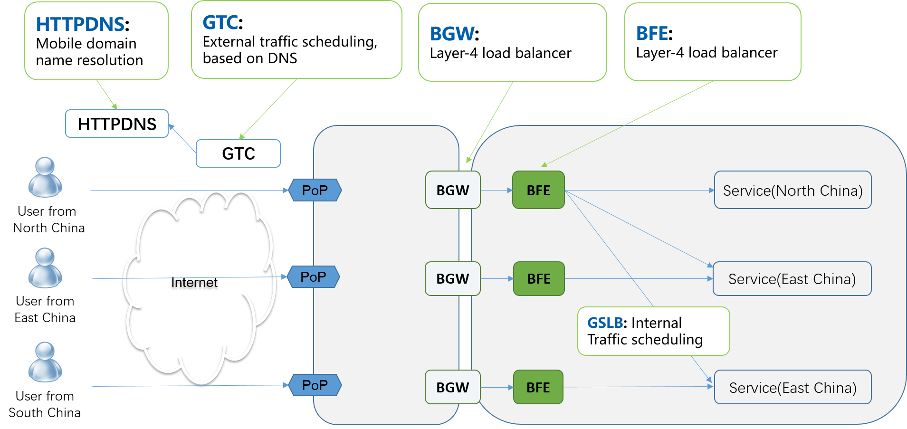

# Introduction to Network Front End

## What is Network Front End? 

The term "FE" (Front End) is often used to distinguish the roles of software engineers: engineers who develop front-end programs based on javascript, html and other technologies on browsers are often referred to as "front-end engineers" or "FE engineers"; The engineers who develop backend programs on the server based on C++, Java, Go and other programming languages are called "back-end engineers".

Network front end is also called Front End, abbreviated as FE. The engineers engaged in network front-end technologies are not "front-end engineers", but "network R&D engineers". Here, "Front End" is a concept generated from the perspective of network and user access. The "Back End" service is located in the data center and cannot be directly accessed by users; The user traffic must be forwarded through the network front-end system (that is, the "front-end") to reach the back-end. We can also define network front-end access as "the process of traffic from users to services".

It is not a simple process for traffic from users to services in the data center. From users to services,  traffic needs to be processed by many systems or devices, including home networks or company networks,  carrier networks, and service providers' own networks. Network front-end access is very critical. If there is a problem in this process, even if the service in the data center is normal, users still cannot access the service well.

## Challenges in network front-end

In network front-end  access, there are several challenges:

(1) Availability

​	Possible problems in this area include:

+ Network failure. User networks, carrier networks, service providers' networks are all possible to fail.

+ Service failure. Services deployed in a data center may not function properly due to problems with data centers, servers, and daemons.

+ Network Attacks. Hackers may launch DDoS or application-layer attacks that can lead to network bandwidth congestion, overload or crashes of service systems.

​	Availability is the most serious problem in network front-end access, which will cause users to have no normal access to services, resulting in traffic loss.

(2) Performance

Possible problems in this area include:

+ Inefficient network protocols. Network protocols have a significant impact on transmission performance. Especially in mobile wireless Internet scenarios, under the influence of delay jitter and high packet loss rate, many of the network protocols previously designed for wired network have performance problems. This situation has also promoted the rapid upgrade of network protocols in recent years.

+ Unoptimized scheduling. In the case of large enterprises with multi-regional and multi-operator access points, how to schedule users from different regions and operators to a reasonable network access point is a very important technology. Network access performance may degrade if the selected access point is not nearby or is not  from suitable operators.

Performance issues can cause users to access services slowly, which directly affects the experience of Internet users.

(3) Security

  Possible problems in this area include:

+ Traffic hijacking. Hackers may direct user traffic to forged websites through DNS hijacking and other means.

+ Content hijacking. A hacker may insert or modify the content of a web page that is not encrypted using HTTPS technology. For example, it is possible to insert advertising content provided by non website owners into the content to obtain illegal economic benefits.

+ Privacy leaks. Hackers can sniff the traffic that is not encrypted using HTTPS technology. For example, hackers  can monitor and collect the user's traffic to understand the user's interest and use this information for advertising and other purposes.

Security issues pose a great threat to Internet service enterprises and Internet users, and may cause huge economic losses.

(4) Efficiency

In the multi region/data center/instance scenario, the non optimized scheduling may lead to unbalanced load at the region/data center/instance level.

This will lead to uneven free and busy among service resources, which will lead to insufficient utilization of service resources.

## Network Front End Access Scheme of Baidu

As a large Internet enterprise, Baidu has a complex scene of multiple regions and data centers. The network front-end access scheme is shown in the figure above, including the following key systems:

+ GTC (Global Traffic Control): Internet traffic dispatching system. It is used to schedule external network traffic between network entrances.

  In terms of network traffic scheduling, there are two possible technical solutions: DNS, or BGP routing. Because of bandwidth charges and other reasons, the IP addresses provided by operators are widely used in China, rather than IP addresses provided by website service providers. Therefore, GTC takes effect mainly based on DNS.

+ HTTPDNS: mobile domain name resolution. It is used to provide domain name resolution service for mobile apps.

  DNS, as an important infrastructure of the Internet, has always been vulnerable to hijacking, slow to take effect, low resolution accuracy and other inherent problems. With the development of mobile Internet, especially the widespread use of mobile APP, new opportunities are provided to solve DNS problems. HTTPDNS is based on encrypted web services, which can solve a series of DNS problems and has been widely used on all important mobile apps of Baidu.

+ BGW (Baidu GateWay):  layer-4 load balancing system. 

  BGW is similar to the famous open source software LVS, but it is a system developed by Baidu based on DPDK technology.

+ BFE: layer-7 load balancing system. Provide application layer load balancing service.

  As a sub function of BFE, GSLB provides intranet traffic scheduling with cluster granularity across data centers.

## links
Previous: [Chap1 Introduction to BFE](../../../en_us/background/what-is-bfe.md)  
Next: [Chap3 Trend of Network Front End Technology](../../../en_us/frontend_principle/trend/trend.md)