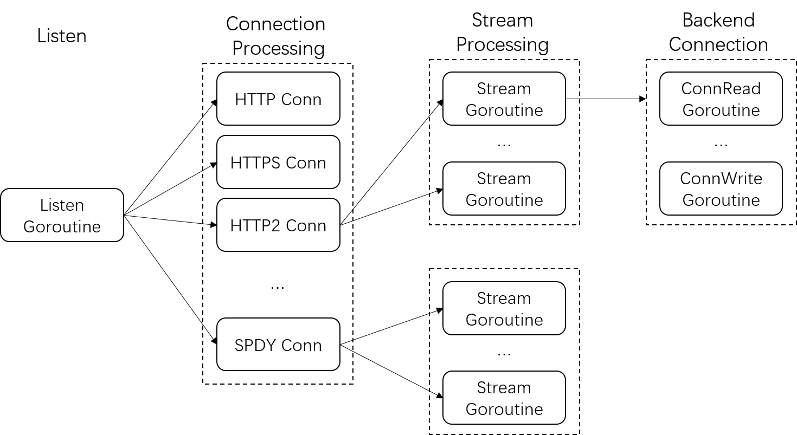

#  Process Model

The BFE system is composed of a group of collaborative processes (see [Introduction to BFE](../../background/what-is-bfe.md) for details). Here we will focus on the most core forwarding process.

## Classification of Goroutines

The forwarding process of BFE is a highly concurrent network server written in Go language and implemented based on Goroutine. The forwarding process of BFE includes several important Goroutines:

- **Network related Goroutines**

  - Goroutines for listening user connections, Goroutines for processing  user connections, and Goroutines  for processing protocols.

  - Goroutines for establishing connection with backends, Goroutines for processing read and write with backend connections.

- **Management related Goroutines**
  - Goroutines for checking backend health status.
  
  - Goroutines for monitoring and doing configuration hot load.
  
- **Auxiliary Goroutines**

  - The extension module can also create Goroutines for periodic operation or asynchronous execution processing in background.

  - For example: periodical log cutting, asynchronous cache update, etc.

## Concurrency Model

The BFE forwarding instance can start one or more listening Goroutines.  If a large number of user accesses are short connections, a single Goroutine for listening only uses a single CPU core and may become a bottleneck. At this time, the throughput can be improved by properly adjusting the number of listening Goroutines.

Each new user connection will be processed concurrently in an independent Goroutine for user connection processing. For the HTTP/HTTPS protocol, the Goroutines for user connection processing serially read requests and process them; For HTTP2/SPDY protocol, because the protocol supports multiplexing, requests are processed in multiple independent Goroutines for stream processing simultaneously.

When forwarding the request to the backend and reading the response, it involves a group of Goroutines for backend connection read and write, which are responsible for writing the request data to the backend connection and reading the response data from the backend connection.





## Concurrency Capability

With Goroutines, BFE can make full use of the multi-core CPU of a single machine to improve concurrency and throughput. However, the concurrency model based on the Go routines also has limitations:

- Concurrency does not continue to grow linearly with the increase of CPU cores

  When the number of cores in a single machine is very large, due to lock competition, increasing the number of cores may not improve the ultimate performance. In practice, in order to achieve the effect of linear improvement of overall performance, the server hardware configuration or container specifications are generally formulated for traffic access scenarios, or services are provided through multiple instances.

- It is difficult to improve extreme performance by taking advantage of CPU affinity.


## Exception Recovery

Due to the complexity of the forwarding process and the characteristics of rapid iterative development, potential PANIC problems are difficult to be completely discovered through offline testing. However, when PANIC is triggered in some cases, it will have a very serious impact on the stability of the forwarding cluster, for example, triggered by a specific type of request (Query of Death).

Therefore, all network related Goroutines of BFE use the built-in PANIC recovery mechanism of Go language to avoid large-scale PANIC exit of BFE forwarding instances due to unknown bugs during connection/request processing.

```go
// bfe_server/http_conn.go:serve()

defer func() {
    if err := recover(); err != nil {
        log.Logger.Warn("panic: conn.serve(): %v, readTotal=%d,writeTotal=%d,reqNum=%d,%v\n%s",
        c.remoteAddr, c.session.ReadTotal, c.session.WriteTotal, c.session.ReqNum,
        err, gotrack.CurrentStackTrace(0))
        ...
    }
    ...
}()
```

When PANIC occurs, it affects only a single connection or request. At the same time, the context log during the PANIC recovery phase is also convenient to efficiently analyze and locate the root cause of the problem. For some problems that are difficult to reproduce offline, based on the log information of PANIC, the answer can often be found through code analysis.
